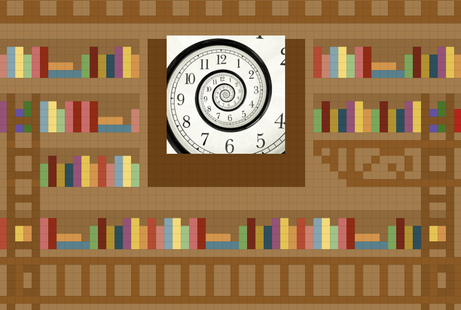
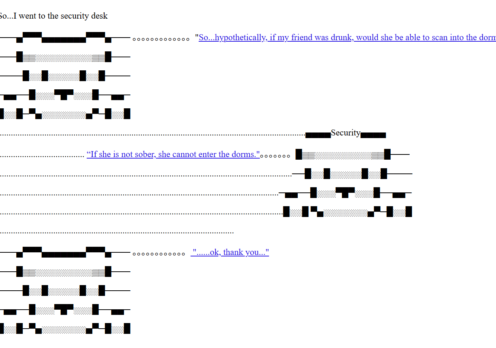
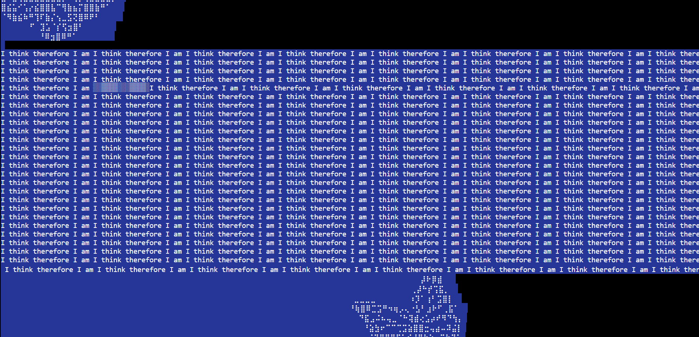
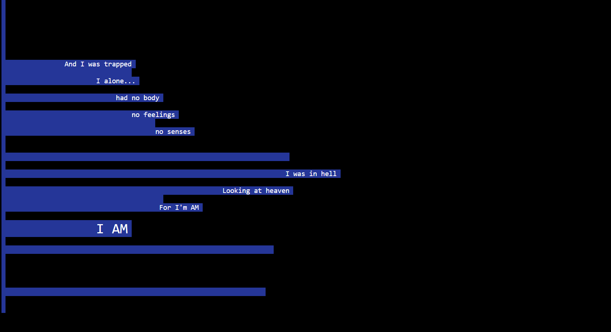
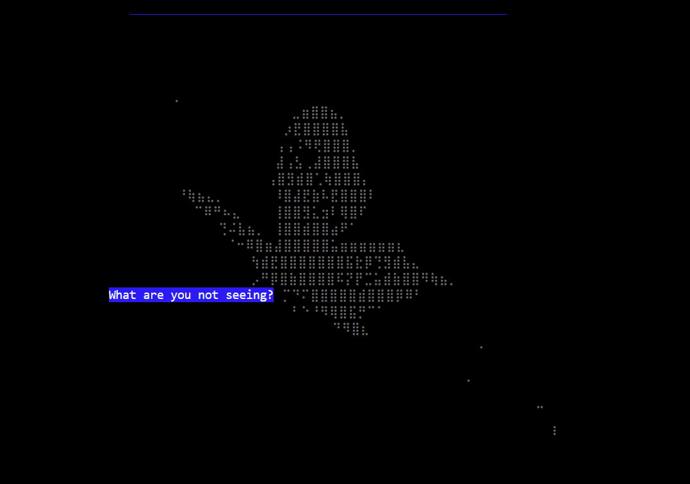

# PaKai's commlab page
## Helloooooo 

The live link is: [https://pakaiii.github.io/Commlab](https://pakaiii.github.io/Commlab)

I made them all this year at NYUSH spring 2026.
- Journey through the sheets
- [Lifescroll](lifescroll)
- [Tutorial on the web](tutorial)
- Shanzhai Project [here!](shanzaiproject)
- Final in progress [here](narrativefinal)

These are some practice and references to look back on:
- flexbox [practice](flexbox)
- webboxes [practice](webboxes)
- [clock](clock) assignment 

# Journey through the sheets
A journey that explores what lies beneath a city!

# Lifescroll

A true story O.o

# Tutorial

A tutorial not made for humans...but rather computers

 

