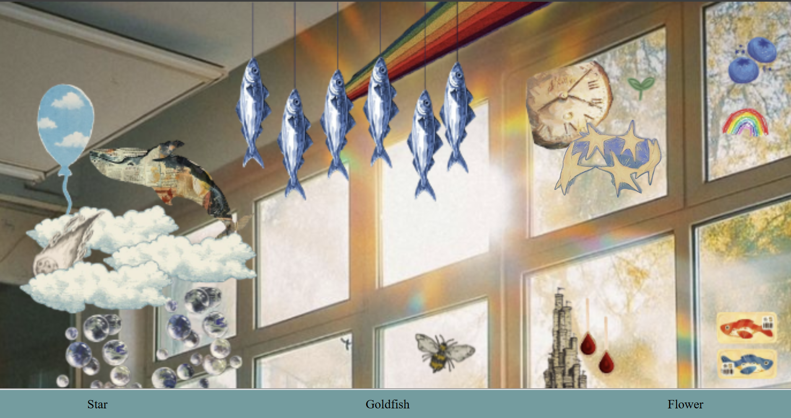
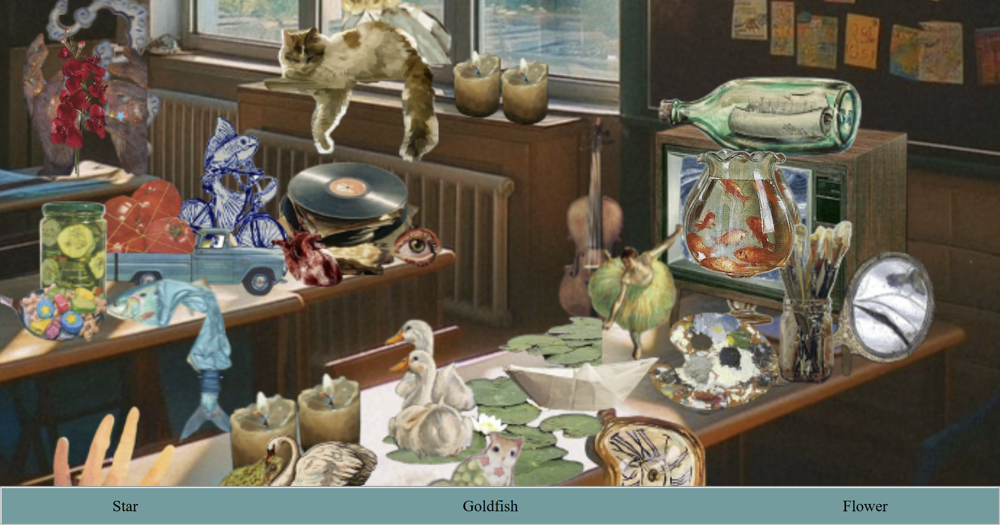
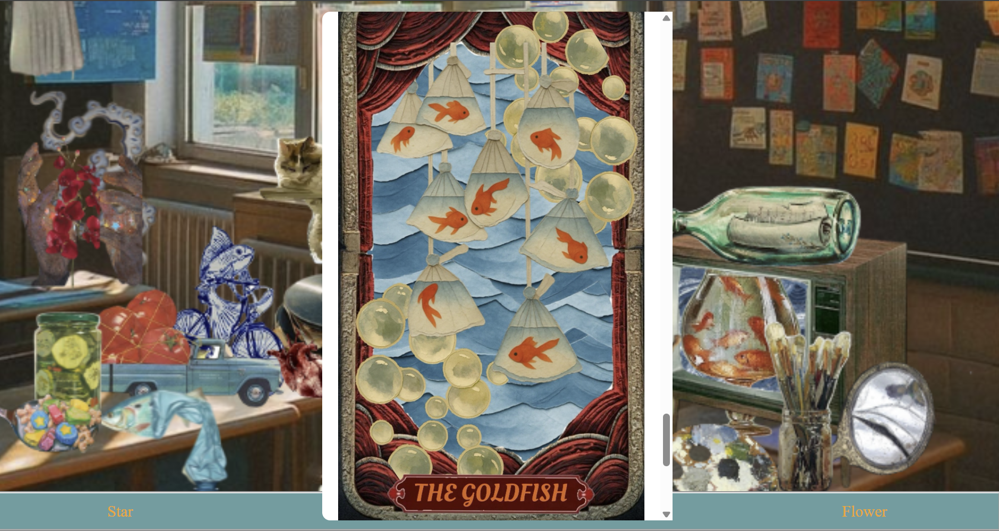

# <pre> I Am Not A Goldfish <pre>
## Created by: PaKai Vang

One day a strange bubble, the physical manifestation of greif, appears over New York City. After a series of dreams, an old group of friends must venture into the bubble to rescue their friend from being overcome with greif. In doing so, they must revist old memories of the past that lead to conflict and allow them to re-examine their past behavior as old secrets are revealed.

## Abstract:
I Am Not A Goldfish is a story exploring a longing for nostalgia and navigating greif. A main plotpoint within the story is rediscovering memories through old objects they find in the bubble. I translated this idea into the medium of the web by creating a hidden item game that reveals more of the story. Other than the interactive game, I used scrolling as the main interactive element because I felt that the action was similar to turning a page. Similar to pages, only a certain amount of the story is visible a time in a webpage, so scrolling allows the user to continue through the story at their own pace. 

## <pre>Preview</pre>

