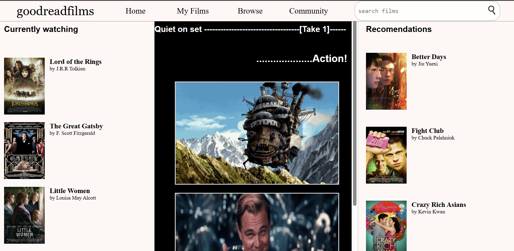

# <pre>Shangzai Project</pre>
# The theme is: 

# .............................Film Adaptations

## utilizing the website goodreads ..................
## Date: 3/9/26 
## Prod Co: Commlab
## Director: PaKai Vang
# _____________________________________________________
### Quiet on set....
### .................Introducing
#           <pre>Goodreadfilms</pre>

Goodreadfilms is a spin on goodreads that shifts the focus from novels to their cinematic adaptations, bridging the gap between literature and cinema. Goodreadfilms allows readers to continue the journey of a beloved story past physical pages through discovering film adaptations, offering a new way to experience the story through a new medium.

## Abstract:
Goodreads is a website used to discover, rate, and review books. However, the primary intent of the platform is to organize, rate, and reviewe the books a person is currently reading rather than to provide a sense of narrative catharsis. So, Goodreadfilms is meant to expand on this concept beyond the act of reading by shifting the focus from books to their cinematic adaptations.
When you finish a good book, it remains on your mind and people often search for more content regarding the story. Goodreadfilms allows users to discover new ways to experience and engage with familiar loved stories through a different medium--film--. Goodreadfilms offers catharsis because it gives people a space to process and reinterpret stories they already have emotional connections to. Stories often affect people deeply, and seeing them adapted into film can create new emotional responses or conclude lingering responses. 

The homepage of Goodreadfilms features a "currently watching" left column and "recommendations" right column, each containing multiple film adaptations of popular novels. The center is a scrollable column formatted to resemble to a film strip that display different scenes of film adaptations in the form of gifs.